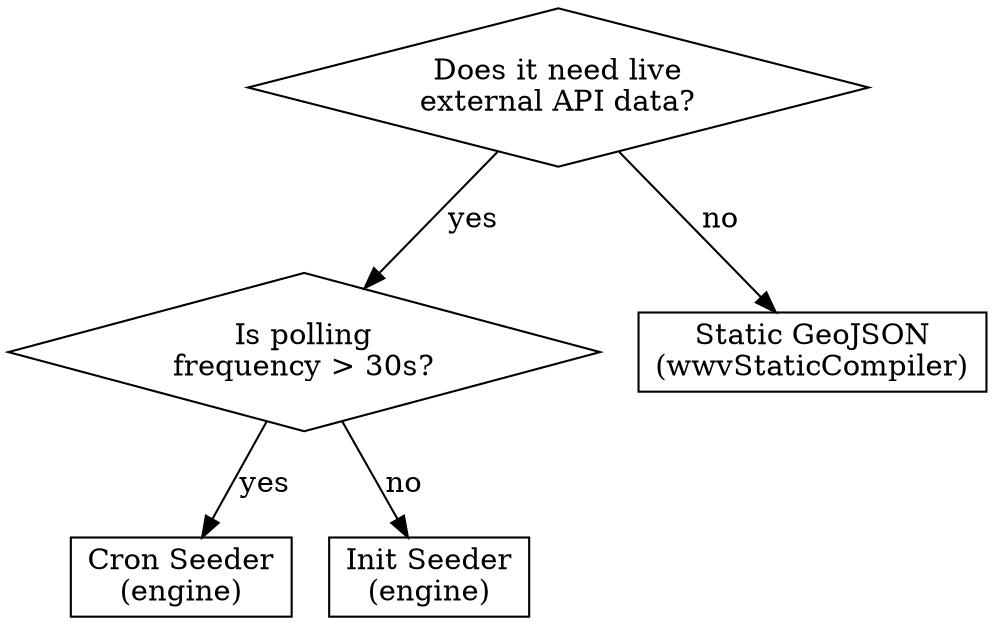

# WorldWideView Plugin Creation

## Overview

A WorldWideView plugin is a self-contained data source that renders geospatial entities on a 3D Cesium globe. Every plugin implements the `WorldPlugin` interface from the SDK and connects to the **V2 Data Engine** (Fastify + Redis) that streams live data over WebSocket.

**Core principle:** Plugins are code bundles. The engine pushes data. The frontend renders it. There is no REST polling between frontend and engine — only WebSocket streaming.

## When to Use

- Creating a new data layer plugin (any architecture)
- Building a new seeder in the data engine
- Plugin data doesn't appear on the globe
- WebSocket subscription or split-routing issues
- Build failures after adding a plugin package
- Debugging `renderEntity` or entity clipping artifacts
- Marketplace plugin installation/validation issues

**Do NOT use for:**
- Modifying globe rendering primitives → see `cesium-rendering` rule
- Zustand state management → see `state-management` rule  
- Prisma schema changes → see `database-migrations` rule
- Monorepo/pnpm workspace issues → see `monorepo-workflow` rule

## Architecture Decision



---

## Quick Reference

| Piece | Location | Purpose |
|---|---|---|
| Sandbox plugin | `local-plugins/wwv-plugin-<name>/` | Local development workspace for new plugins |
| Plugin class | `packages/wwv-plugin-<name>/src/index.ts` | Implements `WorldPlugin` interface |
| Package metadata | `packages/wwv-plugin-<name>/package.json` | `worldwideview` block with id, type, format, category |
| Engine seeder | `wwv-seeders/src/seeders/<name>.ts` | Fetches external data → Redis → WS broadcast |
| Build config | `next.config.ts` → `transpilePackages` | Required for monorepo packages |
| TS alias | `tsconfig.json` → `paths` | Required for monorepo packages |
| Registration | `src/core/plugins/PluginRegistry.ts` | Register plugin at boot |
| WS client | `src/core/data/WsClient.ts` | Client-side WebSocket subscriptions |
| URL resolution | `src/core/data/resolveEngineUrl.ts` | Per-plugin local vs cloud routing |
| Manifest validation | `src/core/plugins/validateManifest.ts` | Checks required fields for CDN bundles |
| Host globals | `src/core/plugins/hostGlobals.ts` | Injects shared deps for CDN plugins |

---

## Part 1: Frontend Plugin (WorldPlugin)

### 1.0 Development Workflow (Local Sandbox)

The standard way to develop a new plugin is using the **Local Sandbox** (`local-plugins/` directory). This keeps experimental code out of the main monorepo packages until it is ready for production.

1. **Scaffold**: Run `node packages/wwv-cli/dist/index.js create <name> --local` from the project root. This generates a boilerplate plugin in `local-plugins/wwv-plugin-<name>`.
2. **Develop**: Run `pnpm dev`. The built-in file watcher (`pnpm dev:plugins`) automatically rebuilds and syncs your local plugin to `public/plugins-local/` whenever you save a file for instant hot-reloading.
3. **Publish (Optional)**: When stable, you can use `node packages/wwv-cli/dist/index.js publish <name>` to publish the plugin to NPM. There is no need to 'link' plugins to the core monorepo manually, as the local sandbox runs natively inside the workspace.

### 1.1 Implement the Interface

Every plugin **must** implement `WorldPlugin` from `@worldwideview/wwv-plugin-sdk`:

```typescript
import type {
  WorldPlugin, PluginContext, GeoEntity,
  CesiumEntityOptions, TimeRange, LayerConfig, PluginCategory
} from "@worldwideview/wwv-plugin-sdk";
import { Flame } from "lucide-react";
import pkg from "../package.json";

export default class WildfiresPlugin implements WorldPlugin {
  id = "wildfires";
  name = "Wildfires";
  description = "Live wildfire incidents from NASA FIRMS";
  icon = Flame;
  category: PluginCategory = "natural-disaster";
  version = pkg.version;  // NEVER hardcode — always import from package.json

  async initialize(ctx: PluginContext): Promise<void> {
    // Store context for later use (env vars, edition, callbacks)
  }

  destroy(): void {
    // Cleanup timers, WebSocket connections, etc.
  }

  async fetch(timeRange: TimeRange): Promise<GeoEntity[]> {
    // For WS-streamed plugins, return [] — data arrives via WsClient
    return [];
  }

  getPollingInterval(): number {
    return 0; // 0 = no REST polling (WS-only)
  }

  getLayerConfig(): LayerConfig {
    return {
      color: "#ef4444",
      clusterEnabled: true,
      clusterDistance: 50,
      maxEntities: 5000,
    };
  }

  renderEntity(entity: GeoEntity): CesiumEntityOptions {
    return {
      type: "point",
      color: "#ef4444",
      size: 6,
      outlineColor: "#ffffff",
      outlineWidth: 1,
    };
  }
}
```

### 1.2 Required vs Optional Methods

**Required:**

| Method | Purpose |
|---|---|
| `initialize(ctx)` | Receive `PluginContext` (env, edition, callbacks) |
| `destroy()` | Cleanup on shutdown |
| `fetch(timeRange)` | Return entities (REST path). Return `[]` for WS-only |
| `getPollingInterval()` | Polling frequency in ms. Return `0` for WS-only |
| `getLayerConfig()` | Layer appearance (color, clustering, max entities) |
| `renderEntity(entity)` | Per-entity Cesium rendering options |

**Optional:**

| Method | Purpose |
|---|---|
| `getServerConfig()` | REST/WS endpoint config (`apiBasePath`, `streamUrl`) |
| `getSelectionBehavior(entity)` | Trail/fly-to on entity click |
| `getFilterDefinitions()` | User-facing filter controls |
| `getLegend()` | Legend entries for layer panel |
| `getSidebarComponent()` | Custom sidebar React component |
| `getDetailComponent()` | Custom detail panel for selected entity |
| `getSettingsComponent()` | Plugin settings UI |
| `getGlobeComponent()` | React component injected into globe view |
| `mapWebsocketPayload(payload, existing)` | Transform raw WS data into `GeoEntity[]` |
| `requiresConfiguration(settings)` | Return `true` if plugin needs setup first |

### 1.3 Package Metadata

The `package.json` **must** include a `worldwideview` block:

```json
{
  "name": "@worldwideview/wwv-plugin-wildfires",
  "version": "1.0.0",
  "main": "src/index.ts",
  "worldwideview": {
    "id": "wildfires",
    "type": "data-layer",
    "format": "bundle",
    "category": "natural-disaster",
    "icon": "Flame",
    "capabilities": ["data:own", "globe:overlay"]
  },
  "dependencies": {
    "@worldwideview/wwv-plugin-sdk": "workspace:*"
  }
}
```

**Valid categories** (lowercase only): `aviation` · `maritime` · `military` · `conflict` · `natural-disaster` · `infrastructure` · `space` · `cyber` · `economic` · `intelligence` · `custom`

**Valid capabilities**: `data:own` · `data:read:{plugin}` · `ui:detail-panel` · `ui:sidebar` · `ui:toolbar` · `ui:settings` · `globe:overlay` · `globe:camera` · `storage:read` · `storage:write` · `network:fetch`

### 1.4 Rendering Rules

| Entity Type | Properties | Notes |
|---|---|---|
| `"point"` | `color`, `size`, `outlineColor`, `outlineWidth` | Simple colored dots |
| `"billboard"` | `iconUrl`, `color`, `iconScale` | SVG/PNG icons |
| `"model"` | `modelUrl`, `modelScale`, `modelMinPixelSize` | 3D glTF models |
| `"label"` | `labelText`, `labelFont`, `color` | Text labels |

> **CRITICAL:** NEVER mix point and billboard properties. Using `size`/`outlineWidth` on a billboard entity causes GPU clipping artifacts. This is a hard rendering constraint.

Use `createSvgIconUrl()` from the SDK for billboard icons:

```typescript
import { createSvgIconUrl } from "@worldwideview/wwv-plugin-sdk";
import { Plane } from "lucide-react";
const iconUrl = createSvgIconUrl(Plane, { color: "#3b82f6" });
```

### 1.5 Registration (3 Paths)

**A. Built-in (monorepo package):**

```typescript
import { pluginRegistry } from "@/core/plugins/PluginRegistry";
import { pluginManager } from "@/core/plugins/PluginManager";
import WildfiresPlugin from "@worldwideview/wwv-plugin-wildfires";

const plugin = new WildfiresPlugin();
pluginRegistry.register(plugin);
await pluginManager.registerPlugin(plugin);
```

`AppShell.tsx` iterates `pluginRegistry.getAll()` at startup.

**B. Marketplace (database-installed):**
`InstalledPluginsLoader` reads from the `installed_plugins` PostgreSQL table and calls `pluginManager.loadFromManifest()`. No code changes needed.

**C. Dynamic import (runtime):**
For user-imported GeoJSON layers, call `pluginManager.loadFromManifest(manifest)` directly.

### 1.6 Build Configuration (Core Monorepo Packages Only)

If you decide to manually move a plugin from the local sandbox into the core `packages/` directory, you must manually add it to the build pipeline:

Add to `next.config.ts`:

```typescript
transpilePackages: [
  "@worldwideview/wwv-plugin-sdk",
  "@worldwideview/wwv-plugin-wildfires", // ADD
],
```

Add to `tsconfig.json`:

```json
"paths": {
  "@worldwideview/wwv-plugin-wildfires": ["./packages/wwv-plugin-wildfires/src"]
}
```

Run `pnpm install` from project root after creating the package.

---

## Part 2: Data Engine Seeder

The data engine is a **content-agnostic Host Environment runner** (`wwv-data-engine`, deployed via Docker). It runs Fastify on port 5000 with Redis caching and WebSocket streaming. Seeders are volume-mounted from `local-seeders/` (dev) or dynamically downloaded and linked via pnpm workspaces from GitHub Releases (`wwv-seeders` and `wwv-seeders-private`) in production.

> [!IMPORTANT]
> If you are **migrating** an existing plugin from `packages/` to `local-plugins/`, use the `migrate-legacy-plugin` skill instead. It covers both frontend routing fixes AND backend seeder build fixes as two independent concerns.

### 2.1 Engine Architecture

```
External API → Seeder (fetch + transform)
  → setLiveSnapshot(pluginId, payload, ttlSeconds)
    → broadcastPluginData() → Active WS subscribers (immediate)
    → Redis SET data:{pluginId}:live (throttled to every 5 min)
  → SQLite history (optional, via better-sqlite3)
```

**Key components:**
- `src/scheduler.ts` — Seeder registry and cron scheduling
- `src/redis.ts` — Redis client, `setLiveSnapshot()` and `getLiveSnapshot()`
- `src/websocket.ts` — WS handler, `broadcastPluginData()`
- `src/seed-utils.ts` — `withRetry()`, `fetchWithTimeout()`, `haversineKm()`
- `src/db.ts` — SQLite (better-sqlite3) for local history storage
- `src/seeders/index.ts` — Auto-discovery, dynamically requires all seeder files

### 2.2 Two Seeder Patterns

**Cron Seeder** (periodic polling — most common):

```typescript
import { db } from "../db";
import { setLiveSnapshot } from "../redis";
import { fetchWithTimeout, withRetry } from "../seed-utils";
import { registerSeeder } from "../scheduler";

// Optional: SQLite history table insert
const insertRow = db.prepare(
  "INSERT OR IGNORE INTO my_data (id, payload, source_ts, fetched_at) VALUES (@id, @payload, @source_ts, @fetched_at)"
);

async function seedMyPlugin() {
  console.log("[MyPlugin] Polling external API...");

  const res = await withRetry(() =>
    fetchWithTimeout("https://api.example.com/data")
  );
  const data = await res.json();

  const items = data.features.map((f: any) => ({
    id: f.id,
    lat: f.geometry.coordinates[1],
    lon: f.geometry.coordinates[0],
    name: f.properties.name,
    // ... transform to your schema
  }));

  // Optional: save to SQLite
  for (const item of items) {
    insertRow.run({
      id: item.id,
      payload: JSON.stringify(item),
      source_ts: Date.now(),
      fetched_at: Date.now(),
    });
  }

  // REQUIRED: Push to Redis + broadcast to WS subscribers
  await setLiveSnapshot("my-plugin", {
    source: "my-plugin",
    fetchedAt: new Date().toISOString(),
    items,
    totalCount: items.length,
  }, 3600); // TTL in seconds
}

registerSeeder({
  name: "my-plugin",       // MUST match the plugin's id on the frontend
  cron: "*/15 * * * *",   // Every 15 minutes
  fn: seedMyPlugin,
});
```

**Init Seeder** (persistent/high-frequency — e.g., ISS every 5s):

```typescript
import { setLiveSnapshot } from "../redis";
import { registerSeeder } from "../scheduler";

function startMySeeder() {
  console.log("[MyPlugin] Starting persistent seeder...");

  async function poll() {
    const res = await fetch("https://api.example.com/live");
    const data = await res.json();
    await setLiveSnapshot("my-plugin", data, 60);
  }

  poll(); // Initial fetch
  setInterval(poll, 5000); // Every 5 seconds
}

registerSeeder({
  name: "my-plugin",
  init: startMySeeder,  // No cron — uses init for persistent polling
});
```

### 2.3 SeederDefinition Interface

```typescript
interface SeederDefinition {
  name: string;          // Plugin ID — MUST match frontend plugin id
  cron?: string;         // Cron expression (e.g., "0 * * * *" = hourly)
  fn?: () => Promise<void>;  // Function called on each cron tick
  init?: () => void;     // Initialization for persistent seeders (websockets, intervals)
}
```

### 2.4 Auto-Discovery & Dependencies

The V2 engine dynamically `import()`s every compiled `.mjs` file in the extracted seeder workspaces. **You do not need to manually import your seeder** — just create the file and call `registerSeeder()` at module scope.

> [!IMPORTANT]
> **V2 Engine Dependencies:** Seeders run in the unified V2 host environment which provides common packages (`zod`, `ws`, `undici`, etc.). **You MUST NOT bundle these dependencies** in your seeder's `dist` folder. Leave them externalized in your build config.

### 2.5 SQLite History (Optional)

For data that benefits from historical queries (playback mode), add a table in `src/db.ts`:

```typescript
db.exec(`
  CREATE TABLE IF NOT EXISTS my_data (
    id TEXT PRIMARY KEY,
    payload JSON NOT NULL,
    source_ts INTEGER NOT NULL,
    fetched_at INTEGER NOT NULL
  )
`);
```

### 2.6 Utility Functions

| Function | Purpose |
|---|---|
| `withRetry(fn, maxRetries, delayMs)` | Exponential backoff retry wrapper |
| `fetchWithTimeout(url, options, timeoutMs)` | Fetch with abort signal (default 15s) |
| `haversineKm(lat1, lon1, lat2, lon2)` | Distance between coordinates in km |
| `sleep(ms)` | Promise-based delay |
| `CHROME_UA` | Chrome User-Agent string for scraping |

---

## Part 3: Data Pipeline (Frontend ↔ Engine)

### 3.1 WebSocket Protocol

**Client → Engine:**
```json
{ "action": "subscribe", "pluginId": "earthquakes" }
{ "action": "unsubscribe", "pluginId": "earthquakes" }
```

**Engine → Client:**
```json
{ "type": "welcome", "engine": "wwv-data-engine-v2", "plugins": ["earthquakes", "wildfires", ...] }
{ "type": "data", "pluginId": "earthquakes", "payload": { "items": [...], "totalCount": 42 } }
```

On subscribe, the engine immediately pushes the latest cached Redis snapshot — no waiting for the next cron tick.

### 3.2 Split-Routing (resolveEngineUrl)

`resolveEngineUrl(pluginId)` determines which engine serves each plugin:

1. **Local engine** (`localhost:5000`) if running and its `/manifest` includes this plugin ← **HIGHEST PRIORITY**
2. Plugin's `getServerConfig().streamUrl` (code override)
3. Plugin's `PluginManifest.dataSource.streamUrl` (manifest override)
4. `NEXT_PUBLIC_WWV_PLUGIN_DATA_ENGINE_URL` env var
5. Fallback: `wss://dataenginev2.worldwideview.dev/stream` (cloud)

### 3.3 Full Data Flow

```
Engine seeder calls setLiveSnapshot(pluginId, payload, ttl)
  → broadcastPluginData() fans out to subscribed WS connections
  → WsClient receives { type: "data", pluginId, payload }
  → WsClient calls plugin.mapWebsocketPayload() if defined
  → DataBus.emit("dataUpdated", { pluginId, entities })
  → DataBusSubscriber → Zustand store.entitiesByPlugin
  → GlobeView (memoized visible entities)
  → EntityRenderer (billboard/point/label primitives)
```

### 3.4 Host Globals (CDN Plugins)

CDN-loaded plugins share the host app's dependencies via `globalThis.__WWV_HOST__`:
- `react`, `react-dom`, `react/jsx-runtime`
- `cesium`, `resium`
- `zustand`
- `@worldwideview/wwv-plugin-sdk`

Use `wwvPluginGlobals()` in your Vite config to externalize automatically:

```typescript
import { defineConfig } from "vite";
import { wwvPluginGlobals } from "@worldwideview/wwv-plugin-sdk";

export default defineConfig({
  plugins: [wwvPluginGlobals()],
  build: {
    lib: { entry: "./src/index.ts", formats: ["es"], fileName: "frontend" },
    rollupOptions: { output: { entryFileNames: "frontend.mjs" } },
  },
});
```

---

## Part 4: Static GeoJSON Plugins

For plugins with static data (no live API), use `wwvStaticCompiler`:

```typescript
import { defineConfig } from "vite";
import { wwvPluginGlobals, wwvStaticCompiler } from "@worldwideview/wwv-plugin-sdk";

export default defineConfig({
  plugins: [wwvStaticCompiler(), wwvPluginGlobals()],
  build: {
    lib: { entry: "./src/index.ts", formats: ["es"], fileName: "frontend" },
  },
});
```

Place GeoJSON in `data/data.json`. The compiler auto-generates a `WorldPlugin` class from `package.json` metadata at build time. No `src/index.ts` needed.

---

## Part 5: Example - Simple ISS Tracker Plugin

Here is a minimal, complete example of a live ISS Tracker plugin utilizing both the frontend SDK and the V2 Engine.

### 1. Frontend Plugin (`local-plugins/wwv-plugin-iss/src/index.ts`)

```typescript
import type {
  WorldPlugin, PluginContext, GeoEntity,
  CesiumEntityOptions, TimeRange, LayerConfig, PluginCategory
} from "@worldwideview/wwv-plugin-sdk";
import { Satellite } from "lucide-react";
import pkg from "../package.json";

export default class IssPlugin implements WorldPlugin {
  id = "iss";
  name = "ISS Tracker";
  description = "Real-time International Space Station tracking";
  icon = Satellite;
  category: PluginCategory = "space";
  version = pkg.version;

  async initialize(ctx: PluginContext): Promise<void> {}

  destroy(): void {}

  async fetch(timeRange: TimeRange): Promise<GeoEntity[]> {
    return []; // WS-only plugin
  }

  getPollingInterval(): number {
    return 0; // WS-only
  }

  getLayerConfig(): LayerConfig {
    return {
      color: "#ffffff",
      clusterEnabled: false,
      maxEntities: 1,
    };
  }

  renderEntity(entity: GeoEntity): CesiumEntityOptions {
    return {
      type: "point",
      color: "#ffffff",
      size: 10,
      outlineColor: "#3b82f6",
      outlineWidth: 2,
    };
  }
}
```

### 2. Backend Init Seeder (`wwv-seeders/src/seeders/iss.ts`)

```typescript
import { setLiveSnapshot } from "../redis";
import { registerSeeder } from "../scheduler";

function startIssSeeder() {
  console.log("[ISS] Starting live tracker...");

  async function poll() {
    try {
      const res = await fetch("https://api.wheretheiss.at/v1/satellites/25544");
      const data = await res.json();

      const item = {
        id: "iss",
        lat: data.latitude,
        lon: data.longitude,
        alt: data.altitude * 1000, // Convert km to meters
        name: "International Space Station",
        speed: data.velocity,
      };

      await setLiveSnapshot("iss", {
        source: "iss",
        fetchedAt: new Date().toISOString(),
        items: [item],
        totalCount: 1,
      }, 10);
    } catch (err) {
      console.error("[ISS] Fetch failed", err);
    }
  }

  poll(); // Initial fetch
  setInterval(poll, 5000); // Poll every 5 seconds
}

registerSeeder({
  name: "iss",
  init: startIssSeeder,
});
```

---

## Common Mistakes

### "Sandbox Plugin Breaking Next.js Build"
1. **Premature Configuration** — Modifying `next.config.ts` (`transpilePackages`) or `tsconfig.json` (`paths`) while a plugin is still in `local-plugins/`. The `local-plugins` sandbox relies on dynamic hot-loading in the browser via `pnpm dev:plugins`. Do **not** touch monorepo configs for local plugins.
2. **Manual Registration** — Manually adding a sandbox plugin to `AppShell.tsx`. Let the local hot-loading manifest handle sandbox plugins dynamically.

### "Missing Boilerplate / Errors in package.json"
1. **Bypassing the CLI** — Creating a plugin manually instead of using `node packages/wwv-cli/dist/index.js create <name> --local`. Always use the CLI to ensure the correct metadata, type definitions, and test scaffolding are generated.

### "No data on the globe"
1. **Seeder name ≠ plugin id** — The `name` in `registerSeeder()` MUST match the `id` property of the frontend `WorldPlugin` class
2. **Engine `/manifest` missing plugin** — Check `GET localhost:5000/manifest` → `plugins` array
3. **WsClient not subscribing** — Add `console.log` in `resolveEngineUrl()` to verify URL resolution
4. **Plugin hardcodes engine URL** — Legacy plugins use `this.context?.apiBaseUrl` instead of `resolveEngineUrl()`. See `migrate-legacy-plugin` skill
4. **`mapWebsocketPayload` missing** — If the engine sends a non-standard payload shape, the plugin must implement `mapWebsocketPayload()` or data silently drops

### "Build crash / Module not found"
1. Missing `transpilePackages` entry in `next.config.ts` → **immediate runtime crash**
2. Missing `tsconfig.json` path alias → TypeScript compilation error
3. Forgot `pnpm install` after creating package → dependency resolution failure

### "Invalid Hook Call" (CDN plugins)
Plugin bundles its own React instead of using host globals. Fix: add `wwvPluginGlobals()` to Vite config.

### "Manifest validation failed"
Required fields: `id`, `name`, `version`, `entry`, `trust`. Entry URL must be from allowed domains (CDN, localhost, `worldwideview.dev`, or relative path). `capabilities` must be non-empty array.

### "GPU clipping / entity disappearing"
Using `size`/`outlineWidth`/`outlineColor` on a `"billboard"` entity. These properties are **point-only**. Billboard uses `iconUrl`/`iconScale`/`color`.

### "Redis snapshot not updating"
`setLiveSnapshot()` throttles Redis writes to every 5 minutes to avoid exceeding Upstash request limits. WebSocket broadcasts are **not** throttled. Check WS delivery first.

### "Category type error"
Categories are **lowercase**: `"aviation"` not `"Aviation"`, `"natural-disaster"` not `"NaturalDisaster"`. Must match the `PluginCategory` union in the SDK.

---

## End-to-End Checklist

- [ ] **Development:** Scaffolded via `node packages/wwv-cli/dist/index.js create <name> --local` and developed in `local-plugins/`
- [ ] **Publishing:** Published to NPM via `node packages/wwv-cli/dist/index.js publish <name>` (if making public)
- [ ] **Frontend:** Plugin class implements `WorldPlugin` with correct `id`
- [ ] **Frontend:** `package.json` has `worldwideview` block with matching `id`
- [ ] **Frontend:** Version imported from `package.json` (never hardcoded)
- [ ] **Frontend:** Added to `transpilePackages` in `next.config.ts`
- [ ] **Frontend:** Added path alias in `tsconfig.json`
- [ ] **Frontend:** Registered via `pluginRegistry` + `pluginManager` in `AppShell.tsx`
- [ ] **Frontend:** `renderEntity()` doesn't mix point/billboard properties
- [ ] **Engine:** Seeder file in `wwv-seeders/src/seeders/<name>.ts` (or private repo)
- [ ] **Engine:** `registerSeeder({ name })` matches frontend plugin `id`
- [ ] **Engine:** Calls `setLiveSnapshot()` with correct plugin ID key
- [ ] **Engine:** Data shape is an object with `items` array (or plugin implements `mapWebsocketPayload`)
- [ ] **Engine:** SQLite table created in `db.ts` if historical data needed
- [ ] **Verification:** `GET localhost:5000/manifest` includes the plugin ID
- [ ] **Verification:** `GET localhost:5000/health` shows seeder last-run timestamp
- [ ] **Verification:** WebSocket subscribe returns data snapshot
- [ ] **Workspace:** Ran `pnpm install` from project root
- [ ] **Workspace:** Version bump follows `/commit` workflow
