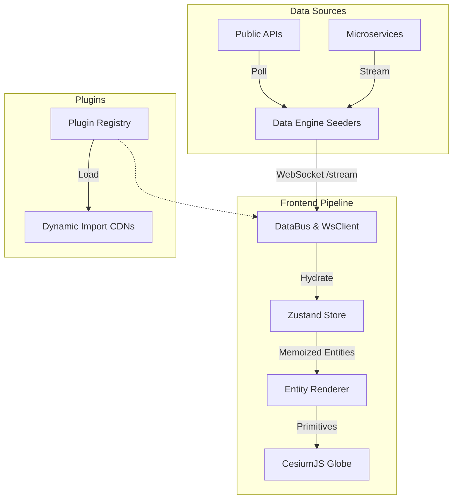

<div align="center">

<!-- Generated: 2026-04-23 06:11:00 UTC -->
# WorldWideView

**The Open-Source, Plugin-Driven Geospatial Intelligence Engine**

*A modular situational awareness platform designed to ingest live data streams and render them as interactive, cinematic layers on a high-fidelity CesiumJS 3D globe.*

[](https://github.com/silvertakana/worldwideview/actions/workflows/ci.yml)
[](https://codecov.io/gh/silvertakana/worldwideview)
[](https://www.npmjs.com/package/@worldwideview/wwv-plugin-sdk)
[](https://github.com/silvertakana/worldwideview/releases)
[](https://github.com/silvertakana/worldwideview/graphs/contributors)
<br>
[](https://nextjs.org/)
[](https://cesium.com/)
[](https://www.typescriptlang.org/)
[](https://www.docker.com/)
[](LICENSE)
[](#)
[](https://makeapullrequest.com)


</div>

---

WorldWideView is a real-time geospatial engine visualizing live global data on an interactive 3D globe. Utilizing a dynamic "All-Bundle" plugin architecture, independent data sources—like live aircraft, maritime vessels, or conflict events—are ingested and rendered decoupled from the core 3D viewer.

## Key Features

- **"All-Bundle" Plugin Architecture**: Ingest any data source dynamically without touching the core platform.
- **High-Fidelity 3D Rendering**: Google Photorealistic 3D Tiles and LOD modeling powered by CesiumJS.
- **Real-Time Data Pipeline**: High-frequency WebSocket updates managed by a custom `DataBus`.
- **Advanced Entity Management**: Automatic horizon culling, chunked primitive rendering, and 3D stacking/spiderification.
- **Marketplace Integration**: Download and sync new plugins directly from the UI.
- **Agent Bus (opt-in)**: HTTP+SSE control surface that lets an external tool — typically an MCP server fronting an LLM — fly the globe, toggle layers, and select entities in the running browser session. Default off; see [Agent Bus docs](docs/agent-bus.md).

## Core Technologies

- **Frontend:** Next.js 16 (App Router), React 19, TypeScript 5
- **3D Engine:** CesiumJS + Resium (Google Photorealistic 3D Tiles)
- **State Management:** Zustand
- **Event Bus:** Custom typed `DataBus` for high-frequency WebSocket updates
- **Database:** PostgreSQL via Prisma 7
- **Deployment:** Docker multi-stage build, Coolify

## Project Architecture

WorldWideView separates the data acquisition layer from the frontend rendering loop, using a real-time event bus to bridge them.



## Prerequisites

Before running the application, ensure you have the following installed:
- [Node.js](https://nodejs.org/) (v18+)
- [pnpm](https://pnpm.io/) (v9+)
- [Docker](https://www.docker.com/) (for self-hosting or full local dev)
- PostgreSQL (or rely on the `coolify-db` / local compose container)

## Quick Start (Self-Hosting)

WorldWideView uses a multi-stage Dockerfile designed for standalone output. To deploy instantly on your own server:

**Mac/Linux:**
```bash
mkdir worldwideview && cd worldwideview
curl -fsSL https://raw.githubusercontent.com/silvertakana/worldwideview/main/setup.sh | bash
```

**Windows (PowerShell):**
```powershell
mkdir worldwideview; cd worldwideview
Invoke-WebRequest -Uri https://raw.githubusercontent.com/silvertakana/worldwideview/main/setup.ps1 -UseBasicParsing | Invoke-Expression
```

> [!NOTE]
> Ensure you connect a PostgreSQL database via the `DATABASE_URL` environment variable for production deployments.

## Quick Start (Local Development)

To run the source code locally for contributing or developing:

```bash
git clone https://github.com/silvertakana/worldwideview.git
cd worldwideview
pnpm install
pnpm run setup   # generates .env.local with AUTH_SECRET
pnpm run dev:all # boots the UI, cache layers, and the data engine
```
Visit `http://localhost:3000` to see the live globe.

## Project Structure

The codebase utilizes a `pnpm` monorepo configuration:

```text
worldwideview/
├── src/                  # Core frontend app
│   ├── app/              # Next.js App Router (pages, API routes)
│   ├── components/       # Shared UI, Globe panels, and 3D layouts
│   ├── core/             # DataBus, Polling, PluginManager, Store
│   └── plugins/          # Built-in plugins and registry logic
├── packages/             # Monorepo packages
│   ├── wwv-plugin-sdk/   # SDK interfaces and manifest schemas
│   └── wwv-plugin-*/     # Individual plugins & their backends
├── prisma/               # Database schemas & migrations
└── .agents/              # Agent rules, workflows, and documentation
```

## Plugin Ecosystem

WorldWideView operates on an open-core philosophy. The platform itself is data-agnostic; all data sources are dynamically imported as plugins at runtime.

- **[Plugin Quickstart Guide](docs/plugin-quickstart.md)**: Learn how to scaffold and link your first plugin using the `@worldwideview/cli`.
- **[Advanced Plugin Guide](docs/plugin-advanced.md)**: Deep dive into microservice data seeders, WebSockets, complex 3D rendering, and Marketplace publishing.

## Repository Ecosystem

WorldWideView is distributed across several specialized repositories:

1. **`worldwideview`** (This Repo): Main frontend, CesiumJS rendering engine, and core plugin framework.
2. **`wwv-data-engine`**: Open-source community data backend for polling public APIs.
3. **`worldwideview-plugins`**: First-party maintained plugins.
4. **`worldwideview-marketplace`**: The web application driving the plugin directory.
5. **`worldwideview-web`**: Marketing and landing site.
6. **[`szski/wwv-mcp`](https://github.com/szski/wwv-mcp)**: Reference MCP server for driving the globe from an LLM agent (Claude Code, Claude Desktop, Cursor, Cline, …) via the [Agent Bus](docs/agent-bus.md). Contributor-hosted today; may move under the project org.

## Development & Workflow

- **Branching & Commits:** We strictly enforce [Conventional Commits](https://www.conventionalcommits.org/) (`feat:`, `fix:`, `refactor:`). Every commit should utilize our semantic versioning `[/commit]` workflow.
- **Coding Standards:** We emphasize vanilla CSS (no Tailwind), strict TypeScript 5, and file modularity (max 150 lines per file).
- **Testing:** We use Vitest with `jsdom`. All new core logic should be accompanied by tests, running via `pnpm test`.

See [Docs: Development](docs/development.md) and [Docs: Testing](docs/testing.md) for more details.

## Contributing

We welcome community contributions! Please review our coding standards and PR processes before submitting code. For detailed instructions on local development and setting up your environment, see our [CONTRIBUTING.md](CONTRIBUTING.md).

## License

This project is licensed under the MIT License - see the [LICENSE](LICENSE) file for details.

## Documentation Index

Explore our comprehensive documentation suite for detailed engineering insights:

- **[Project Overview](docs/project-overview.md)**: High-level value proposition and technology stack.
- **[Architecture](docs/architecture.md)**: DataBus event stream and Zustand state management.
- **[Build System](docs/build-system.md)**: Monorepo structure, Next.js standalone output, and Docker builds.
- **[Development](docs/development.md)**: Coding conventions and common implementation patterns.
- **[Testing](docs/testing.md)**: Vitest setup and coverage targets.
- **[Deployment](docs/deployment.md)**: Coolify integration and persistent volumes.
- **[Agent Bus](docs/agent-bus.md)**: Wiring an MCP server (or any external tool) to drive the running globe.
- **[Files Catalog](docs/files.md)**: Comprehensive mapping of core source files.

> [!IMPORTANT]
> **Fair-Use Notice:** This application may contain copyrighted material the use of which has not always been specifically authorized by the copyright owner. Such material is made available for educational purposes, situational awareness, and to advance understanding of global events under "fair use" (Section 107 of the US Copyright Law).
